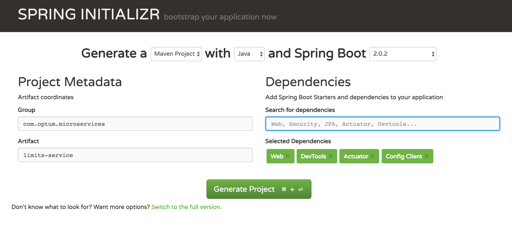

# Limits Service

We will develop limits service to read configuration from properties file

## Step 1: Bootstrap simple REST service
* Open URL https://start.spring.io/
* Pick latest boot version and add dependencies as shown below.



* On clicking generate, a zip file will be downloaded, unzip and keep it in a folder somewhere.
* Open this project in your favorite IDE. First time setup takes time for Spring Boot.
* Run com.optum.microservices.limitsservice.LimitsServiceApplication to assure service is working fine.
Should show below on run
```
Started LimitsServiceApplication in 8.917 seconds (JVM running for 10.546)
```

## Step 2: Create a bean to serve data through REST

* Create a bean to return value from controller com.optum.microservices.bean.LimitConfiguration

```java
public class LimitConfiguration {

    private int maximum;
    private int minimum;

    protected LimitConfiguration() {
    }

    public LimitConfiguration(int maximum, int minimum) {
        this.maximum = maximum;
        this.minimum = minimum;
    }

    public int getMaximum() {
        return maximum;
    }

    public int getMinimum() {
        return minimum;
    }
}
```

## Step 3: Adding configuration to properties

* Make below entries to existing application.properties inside resources folder.
```
spring.application.name=limits-service
limits-service.minimum=1
limits-service.maximum=999

```

## Step 4: Create property configuration reader

* Add com.optum.microservices.limitsservice.Configuration class
* Add fields maximum, minimum same as added in application.properties and generate getters/setters
* Also add prefix we have used in properties "limits-service" to annotation ConfigurationProperties

```java
@org.springframework.context.annotation.Configuration
@ConfigurationProperties("limits-service")
public class Configuration {

    private int maximum;
    private int minimum;

    public int getMaximum() {
        return maximum;
    }

    public void setMaximum(int maximum) {
        this.maximum = maximum;
    }

    public int getMinimum() {
        return minimum;
    }

    public void setMinimum(int minimum) {
        this.minimum = minimum;
    }
}
```

## Step 5 : Create REST controller to handle incoming requests
* Create a class com.optum.microservices.limitsservice.LimitsConfigurationController
* Create a public method retrieveLimitsFromConfiguration and annotate this method for GetMapping as /limits.
* Annotate class with annotation RestController
    
```java
@RestController
public class LimitsConfigurationController {

    @GetMapping("/limits")
    public LimitConfiguration retrieveLimitsFromConfiguration() {
    }
}
```
* Autowire this class with instance of configuration reader to read value from properties file

```java
@RestController
public class LimitsConfigurationController {

    @Autowired
    private Configuration configuration;

    @GetMapping("/limits")
    public LimitConfiguration retrieveLimitsFromConfiguration() {
        return new LimitConfiguration(configuration.getMaximum(), configuration.getMinimum());
    }
}
```

* Restart your application and hit URL http://localhost:8080/limits
```console
{"maximum":999,"minimum":1}
```
