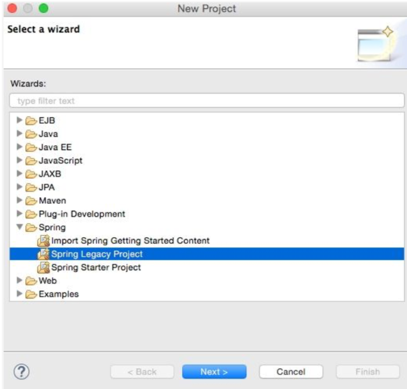
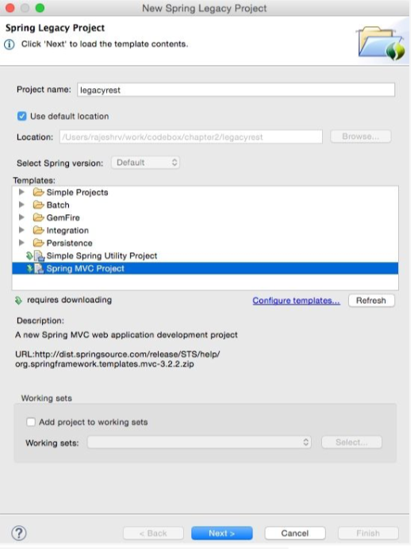
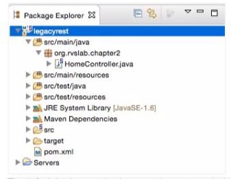
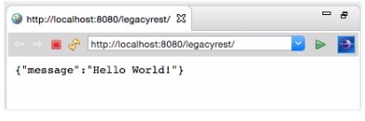

# Developing a Legacy RESTful Web Service

## Step 1: Create a New Project

Start STS and set a workspace of choice for this project.

Navigate to **File** -> **New** -> **Project**

Select **Spring Legacy Project** as shown in the following screenshot and click on **Next**:




## Step 2: Select **Spring MVC Project** as shown in the following diagram and click on **Next**:



Select a top-level package name of choice. This example uses `org.rvslab.chapter2.legacyrest`
as the top-level package.

Then, click on Finish.

This will create a project in the STS workspace with the name `legacyrest`.

Before proceeding further, `pom.xml` needs editing.
Change the Spring version to `4.2.6.RELEASE`, as follows:

```xml
 <org.springframework-version> 4.2.6.RELEASE </org.springframework-version>
```

Add **Jackson** dependencies in the `pom.xml` file for `JSON-to-POJO` and `POJO-to-JSON` conversions. Note that the `2.*.*` version is used to ensure compatibility with Spring 4.

```xml
<dependency>
  <groupId>com.fasterxml.jackson.core</groupId>
  <artifactId>jackson-databind</artifactId>
  <version>2.6.4</version>
</dependency>
```

Some Java code needs to be added. In **Java Resources**, under **legacyrest**, expand the package and open the default `HomeController.java` file:



```java
@RestController
public class HomeController {
  @RequestMapping("/")
  public Greet sayHello(){
    return new Greet("Hello World!");
  }
}
class Greet {
  private String message;
  public Greet(String message) {
    this.message = message;
  }
  //add getter and setter
}
```

Examining the code, there are now two classes:

 *  `Greet` : This is a simple Java class with getters qnd setters to represent a data object. There is only one attribute in the `Greet` class, which is `message`.
 *  `HomeController.java` : This is nothing but a Spring Controller REST endpoint to handle HTTP requests.

Note the annotation used in `HomeController` is `@RestController` which automatically injects `@Controller` and `@ResponseBody` and has the same effect as the following code:


```java
@Controller
@ResponseBody

public class HomeController { }
```

The project can now be run by right-clicking on **legacyrest**, navigating to **Run As** -> **Run On Server**, and passing in the default server (Pivotal to Server Developer Edition v3.1) that comes with STS.

This should automatically start the server and deploy the web application on the TC Server. If the server started properly, the following message should appear in the console:

```console
INFO: org.springframework.web.servletDispatcherServlet - FrameworkServlet `appServlet`: initialization completed in 906ms
Sep 16, 2019 08:22:48 PM org.apache.catalina.startup.Catalina start
INFO: Server 

```


If everything is fine, STS will open a browser window to `http://localhost:8080/legacyrest. Right-click on and navigate to **legacyrest** -> **Properties** -> **Web Project Settings**
and review **Context Root** to identify the context root of the web application:



The alternate build option is to use Maven. Right-click on the project and navigate to **Run As** -> ** Maven install**. 
This will generate `chapter2-1.0.0-BUILD-SNAPSHOT.war` under the target folder. This war is deployable in any servlet container such as Tomcat, JBoss, and so on.
