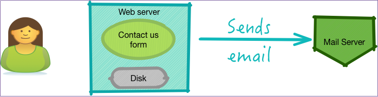

# Exercise 4: Group Discussion: Analyzing an Application for Resiliency

## Overview
**Time:**  10-20 Minutes

In this exercise, we will examine an application for potential failure scenarios.

## Step 1: A form mailer application

We have a web form: **Contact US**
It collects some information and sends an email to the company.

## Step 2: What are the failure scenarios you can think of?

Here are some pointers to think about:
 * What if remote mail server connection is refused?

 * What if web server fails?
 * What if web server disk becomes full?

