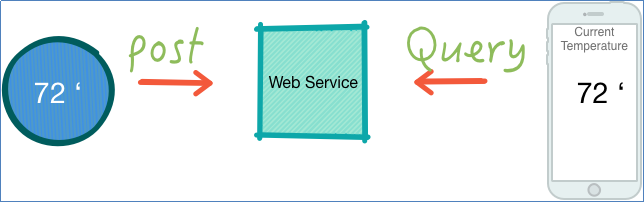

# Exercise : Group Discussion: Designing an Application for Resiliency

## Overview
**Time:**  20-30 Minutes

In this exercise, we are going to design a resilient IOT (Internet of Things) application.

## Step 1: A form mailer application

 * Imagine we have an IOT device – a thermostat - at home.
 * It reports temperature data to a web service.
 * We also have a web service that the user can access to see the current temperature.
 * We also keep historical temperature readings.

Here is an overview:

## Step 2: Form Groups

 * Self-organize into 3 or 4 groups.
 * Sit together so can discuss freely.

## Step 3: Group Design

 * Design the system that is highly available and resilient.

 * Think of all the components we may need for this service.
Do we need a datastore?  What kind?  etc.

## Step 4: Present Your Design to the Class

 * Each group presents their design.
 * We will learn together!

