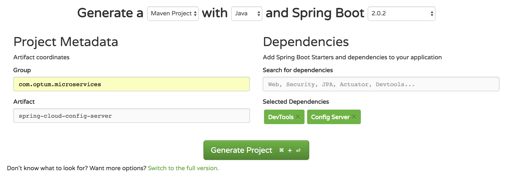

# Spring cloud config server

We will generate and setup spring cloud config server to hold maximum and minimum 
configuration properties and will run on port 8888.
This service will serve limits-service with properties.

## Step 1: Setup git local repo with config file
   * Create a folder anywhere on your machine and do git init
   * Add this folder as external resource (optional step)
   * Create a properties file inside this folder, this is configuration server, but file name has to be be same
    as application name for which we are creating configuration i.e limits-service.properties
   * Move below entries from application.properties of limits-service to this new config project,
     now on limits-service will get configuration from spring cloud config.
     
```  
     limits-service.minimum=1
     limits-service.maximum=999
```  
    
   * Run git init inside new folder and add newly created file
   * Commit this file locally, no need to push.
 
## Step 2: Generate and setup spring cloud config server on port 8888
* Setup
   * Create a new project from https://start.spring.io/ and add config server in dependency as shown below
   

   
   * Generate project and open with IDE
   - Make below entries to application.properties
```
    spring.application.name=spring-cloud-config-server
    server.port=8888
    spring.cloud.config.server.git.uri=file://{git-localconfig-repo-path}
    
 ```
 * Change git-localconfig-repo-path with full path on your machine, you can also use github file
 * add @EnableConfigServer to com.optum.microservices.springcloudconfigserver.SpringCloudConfigServerApplication

Run spring cloud config server and hit URL http://localhost:8888/limits-service/default
    
```console    
    {"name":"limits-service","profiles":["default"],"label":null,"version":"d7bbc8de7b6d61e4da2f8f20dcfea8b24954dc34","state":null,"propertySources":[{"name":"file://resources/git-localconfig-repo/limits-service.properties","source":{"limits-service.minimum":"8","limits-service.maximum":"8888"}}]}
 ```
 
## Step 3: Changes to limits-service to read from spring cloud config server
* Rename application.properties inside limits-service to bootstrap.properties
* Add spring.cloud.config.uri=http://localhost:8888 to bootstrap.properties
* Run application and now limit service will read property from spring-cloud-config-server running
on port 8888. 